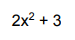

hello,

Scripts:
'npm install' - installs node packages,
'npm run build' - compiles src/.ts files to lib/.js
'npm run test' - runs tests on compiled js files

function addPolynomials inputs format:
[ [exponent, coefficient], [exponent, coefficient], ... ]

e.g.

will be written as [ [0, 3], [2, 2] ]

output format:
[ [exponent, coefficient], [exponent, coefficient], ... ]

Output polynomials terms are sorted by the smallest exponent value.
